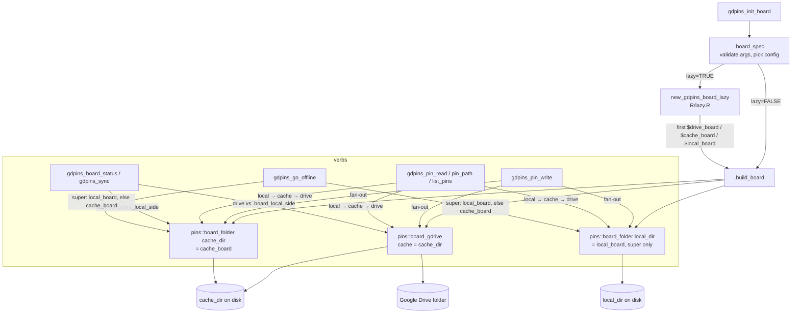

# Local Cache Layer — Current Design

State of code: gdpins 0.0.1.9023, branch `fix/raw-sync-locked-files` (2026-10-03).
Audience: developers + AI agents. Describes the code **before** the single-local-copy change.

## Overview

A Drive-backed `gdpins_board` always carries a **local cache**: `cache_dir` is a
mandatory argument whenever `drive_path` is supplied, there is no default path,
no option, and no way to opt out. The cache directory does double duty:

1. **pins download scratch** — passed as `cache =` to `pins::board_gdrive()`, so
   every Drive read lands files under `<cache_dir>/<pin>/<version>/`.
2. **gdpins local mirror** — wrapped a second time as `pins::board_folder(cache_dir)`
   and stored as `board$cache_board`. gdpins writes to it on every
   `gdpins_pin_write()`, reads from it before Drive, compares it against Drive in
   `gdpins_board_status()`/`gdpins_sync()`, and falls back to it when offline.

Both layers share the same `<dir>/<pin>/<version>/` layout, so a file that pins
downloads through `drive_board` is immediately visible to `cache_board` as a
local pin. That coincidence is what makes "read once online, read again offline"
work today.

An optional third copy, `local_dir` → `local_board`, exists only in the
`"drive_cache_local"` config. It is read first and written to, but it is **not**
the side the sync engine compares — `cache_board` is. Raw connections
(`gdpins_raw_connect()`) have no cache concept at all: `local_path` is the one
local copy.

## Architecture Diagram

## Components

### Config resolution

**Purpose**: Pure argument validation; decides which of the three configs a
board is and errors when `cache_dir` is absent for a Drive board.

**Location**: `R/board.R`

**Key Functions**:
- `.board_spec()` — derives `config` from which of `drive_path`/`cache_dir`/`local_dir`
  are non-NULL; aborts `"cache_dir is required when drive_path is supplied"`.
- `.config_components()` — config → component names; used by print/format so a
  lazy board can be described without connecting.
- `.BOARD_CONFIGS` (`R/classes.R`) — `"local_only"`, `"drive_cache"`, `"drive_cache_local"`.

**Config table (current)**:

| config | drive_board | cache_board | local_board | triggered by |
|---|---|---|---|---|
| `local_only` | – | – | ✓ | `local_dir` only |
| `drive_cache` | ✓ | ✓ | – | `drive_path` + `cache_dir` + `adapter` |
| `drive_cache_local` | ✓ | ✓ | ✓ | all three |

### Board construction

**Purpose**: Creates directories and the three `pins` boards; owns the
offline fallback.

**Location**: `R/board.R`

**Key Functions**:
- `.build_board()` — `fs::dir_create(cache_dir)`; real adapter →
  `pins::board_gdrive(as_id(folder_id), cache = cache_dir)`; fake adapter →
  `board_folder(<fake_root>/<drive_path>)`; then always
  `cache_board <- pins::board_folder(cache_dir, versioned)`.
- Offline branch of `.build_board()` — if `gdpins_is_online()` is FALSE the
  board is **downgraded to `"local_only"`**: `drive_cache_local` uses
  `local_dir`; `drive_cache` reuses `cache_dir` *as* `local_dir`.
- Drive-ID fast path (`nocov`) — same construction when `drive_path` is a raw
  folder ID.

**Interactions**: called eagerly by `gdpins_init_board(lazy = FALSE)` or by
`.board_force()` on first component access.

### Frozen board object

**Purpose**: Field layout every other module relies on.

**Location**: `R/classes.R`

**Key Functions**:
- `new_gdpins_board()` — fields `config, name, drive_board, cache_board,
  local_board, cache_dir, local_dir, drive_path, adapter, versioned`. Marked
  FROZEN in roxygen; validates `config %in% .BOARD_CONFIGS`.

### Lazy wrapper

**Purpose**: Defers `.build_board()` to first use.

**Location**: `R/lazy.R`

**Key Functions**:
- `.LAZY_FIELDS` — `drive_board`, `cache_board`, `local_board`; reading any of
  them via `$`/`[[` forces the connection.
- `new_gdpins_board_lazy()` — stores `cache_dir`/`local_dir` as declared
  metadata (answerable without connecting).
- `.board_field()` — after resolution *every* field is served from the resolved
  set, because the offline fallback may have rewritten `config` and `local_dir`
  (to the cache dir).

### Read/write verbs

**Purpose**: Fan-out writes, local-first reads.

**Location**: `R/verbs.R`

**Key Functions**:
- `gdpins_pin_write()` — writes to each non-NULL of `drive_board`,
  `cache_board`, `local_board` in that order. Blocks when a Drive board is
  offline.
- `gdpins_pin_read()` — tries `local_board` → `cache_board` → `drive_board`;
  a Drive read when offline warns and returns `NULL`.
- `.pin_sources()` / `.pin_candidates()` — same order; used by name resolution
  and glob listing.
- `gdpins_pin_path()` — `pins::pin_download()` on the first source that has the
  pin; for `drive_board` this materialises files into `cache_dir`.
- `gdpins_pin_remove()` — `pin_delete()` on every component that has the pin.

### Sync / status engine

**Purpose**: Compare Drive with "the local side" and reconcile.

**Location**: `R/sync.R`

**Key Functions**:
- `.board_local_side()` — **prefers `cache_board`, else `local_board`**. This is
  the single decision point that makes the cache, not `local_dir`, the
  authoritative local copy for drift detection.
- `gdpins_board_status.gdpins_board` — per-pin version/hash comparison of
  `drive_board` vs `.board_local_side()`; offline → all rows `"offline"` using
  the local side's pin list.
- `gdpins_sync.gdpins_board` — copies via `.copy_pin_to_board()` between
  `drive_board` and `.board_local_side()`; emits
  `"New-computer setup detected: local cache is empty."` when the local side
  has no pins.
- `.handle_init_sync()` (`R/board.R`) — runs the status check at connect time
  and applies `on_discrepancy`.

### Offline mode

**Purpose**: Deliberate detach/reattach.

**Location**: `R/offline.R`

**Key Functions**:
- `gdpins_go_offline.gdpins_board()` — `drive_cache_local` → keeps
  `local_board`; `drive_cache` → promotes `cache_board`/`cache_dir` to
  `local_board`/`local_dir`. Stashes `cache_board`/`cache_dir` in an attribute.
- `gdpins_go_online.gdpins_board()` — for `drive_cache_local`, first copies every
  pin `local_board → cache_board`, because offline writes went to `local_board`
  only while the sync engine compares `cache_board`. Then rebuilds the board
  and runs `.handle_init_sync()`.

### Prune

**Location**: `R/prune.R`

- `gdpins_prune_pin_versions()` — for `drive_cache`/`drive_cache_local` trashes
  old versions on Drive, then `.remove_local_version(board$cache_board$path, …)`;
  for `drive_cache_local` additionally prunes `local_board$path`.

### Discovery and output

**Location**: `R/discovery.R`, `R/output.R`

- `.read_source()` and `.resolve_read_board()` — `local_board > cache_board >
  drive_board`; used by `gdpins_list_pins()`, `gdpins_pin_info()`,
  `gdpins_publish_output()`.

### Print / summary

**Location**: `R/board.R`

- `format.gdpins_board()` — `[DCL]` component flags from `.config_components()`.
- `print.gdpins_board()` / `summary.gdpins_board()` — emit a `cache` line when
  `cache_dir` is non-NULL.

### pins layer (external, verified against pins 1.4.2)

- `pins::board_gdrive(path, cache = NULL)` — when `cache` is `NULL` pins
  **silently** uses `board_cache_path("gdrive-<hash>")`, i.e.
  `rappdirs::user_cache_dir("pins")` (or `PINS_CACHE_DIR`, or `tempdir()` under
  `R_CONFIG_ACTIVE`/`PINS_USE_CACHE`). gdpins never passes `NULL`, so this
  default is currently unreachable.
- `pin_fetch.pins_board_gdrive()` / `pin_meta.pins_board_gdrive()` — download
  `data.txt` and pin files into `<cache>/<name>/<version>/`. Even a pure
  metadata query writes `data.txt` into the cache.
- `pin_store.pins_board_folder()` — writes to `<path>/<name>/<version>/`; files
  are chmod'd read-only. Identical layout → cache_board sees Drive downloads.
- `pin_list.pins_board_folder()` — lists subdirectories of `path`; any
  download-created pin dir therefore counts as a local pin.

## Data Flow

**Write (online, `drive_cache_local`)**: `gdpins_pin_write()` → serialise once →
`pin_write()` to Drive, then to `cache_dir`, then to `local_dir`. Three copies,
three version labels generated independently (timestamps may differ by a second;
prune works per board because of this).

**Read**: `local_board` hit → done. Miss → `cache_board` hit → done. Miss →
`drive_board`: pins downloads into `cache_dir`, so the *next* read is a
`cache_board` hit. Nothing is ever written back to `local_dir` on read.

**Status / sync**: Drive vs `cache_board` only. `local_dir` content is invisible
to drift detection unless something copied it into the cache
(`gdpins_go_online()` does this explicitly).

**Offline at connect**: board becomes `local_only`; `drive_cache` boards point
`local_dir` at the cache dir, so `board$local_dir` no longer equals what the
user passed.

**Raw connection (contrast)**: `gdpins_raw_connect()` → `local_path` is the
mirror and the compared side; downloads go straight there
(`gdpins_raw_path()`); no second directory.

## Configuration

| Knob | Where | Effect |
|---|---|---|
| `cache_dir` arg | `gdpins_init_board()` | Required with `drive_path`; path string only; `NULL` → abort. |
| `local_dir` arg | `gdpins_init_board()` | Adds `local_board`; does **not** remove the cache. |
| `lazy` / `gdpins.lazy_boards` | `R/zzz.R` | Only delays cache creation. |
| `PINS_CACHE_DIR`, `PINS_USE_CACHE`, `R_CONFIG_ACTIVE` | pins | Inert today — gdpins always supplies `cache`. |

There is no `gdpins.*` option, env var, or `FALSE` value for the cache.

## Agreed redesign (2026-10-03)

Full plan, roles, and task briefs: `tools/plan-single-local-copy.md`. Summary:

- One local copy per Drive board, held in `local_board`; path in `cache_dir`. `cache_board` and
  `local_dir` fields removed. Configs: `local_only`, `drive_cache`, `drive_only`.
- `cache_dir = NULL` (default) → `~/.gdpins/cache/<adapter root>/<drive_path>` via option
  `gdpins.cache_dir` (set in `.onLoad()` from `fs::path_home()`). `cache_dir = "path"` → that
  path. `cache_dir = FALSE` → no local copy; pins downloads into a session `tempfile()`.
- `local_dir` deprecated with `lifecycle::deprecate_warn()`; value used as `cache_dir` unless
  `cache_dir` also given.
- `pins::board_gdrive(cache=)` points at the local copy, so Drive downloads land in it.
- `.board_local_side()` returns `local_board`; `gdpins_go_online()` loses its local→cache copy loop.

### Why the current design had to change
1. The cache, not `local_dir`, was the sync-authoritative side; `local_dir` content was invisible
   to drift detection unless `gdpins_go_online()` copied it across.
2. `drive_cache_local` wrote every pin three times.
3. No default and no opt-out for the cache; `pins`' own silent default was unreachable.
4. Blast radius at time of writing: 260 `cache_dir`/`cache_board` references across 14 test
   files; README, two vignettes, pkgdown desc, ~10 roxygen examples.

## Code References

| Component | File | Key Symbols |
|---|---|---|
| Config resolution | `R/board.R` | `.board_spec()`, `.config_components()`, `gdpins_init_board()` |
| Construction + offline fallback | `R/board.R` | `.build_board()`, `.handle_init_sync()` |
| Frozen object | `R/classes.R` | `new_gdpins_board()`, `.BOARD_CONFIGS` |
| Lazy | `R/lazy.R` | `.LAZY_FIELDS`, `new_gdpins_board_lazy()`, `.board_field()`, `.board_force()` |
| Verbs | `R/verbs.R` | `gdpins_pin_write()`, `gdpins_pin_read()`, `gdpins_pin_path()`, `gdpins_pin_remove()`, `.pin_sources()` |
| Sync | `R/sync.R` | `.board_local_side()`, `gdpins_board_status.gdpins_board`, `gdpins_sync.gdpins_board`, `.copy_pin_to_board()` |
| Offline | `R/offline.R` | `gdpins_go_offline.gdpins_board`, `gdpins_go_online.gdpins_board` |
| Prune | `R/prune.R` | `gdpins_prune_pin_versions()`, `.remove_local_version()` |
| Discovery / output | `R/discovery.R`, `R/output.R` | `.read_source()`, `.resolve_read_board()` |
| Options | `R/zzz.R` | `.onLoad()` |
| Raw contrast | `R/raw-connection.R` | `gdpins_raw_connect()`, `new_gdpins_raw_conn()` (`R/classes.R`) |
| Test fixtures | `tests/testthat/helper-fakes.R` | `new_fake_board()` |

## Glossary

| Term | Definition |
|---|---|
| cache_dir / cache_board | Mandatory local directory for Drive boards; both pins' download target and gdpins' sync-compared mirror. |
| local_dir / local_board | Optional standalone local `board_folder`; read first, written to, never compared by sync. |
| super config | `"drive_cache_local"`: Drive + cache + local. |
| local side | Result of `.board_local_side()`: `cache_board` if present, else `local_board`. |
| fan-out | Writing the same pin to every non-NULL component. |
| lazy board | Board whose `.build_board()` runs on first component access. |
| raw connection | `gdpins_raw_conn`: plain files, one `local_path` mirror, no cache. |
